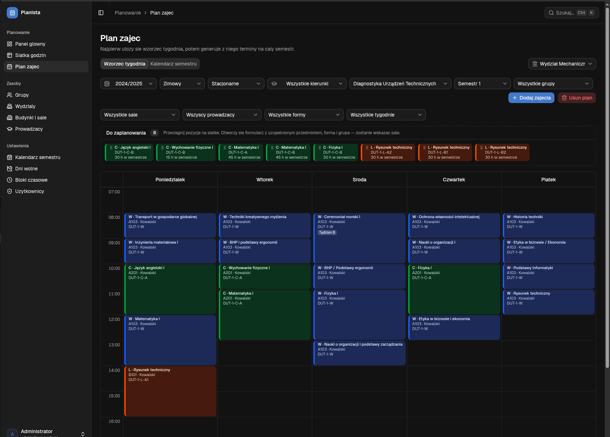
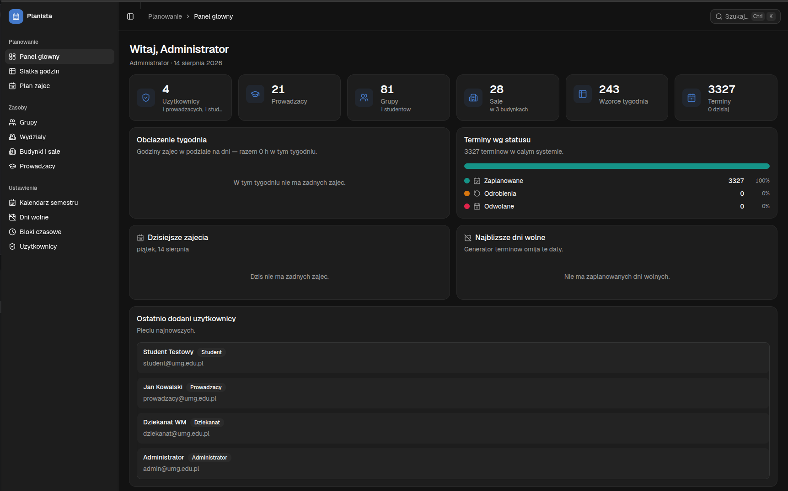
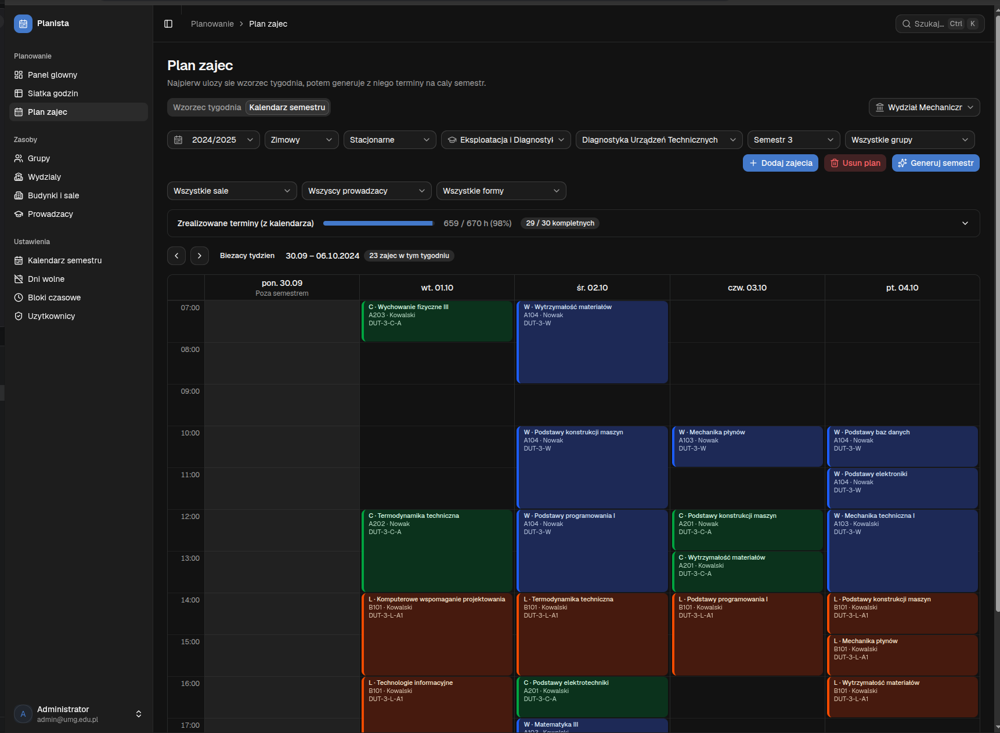
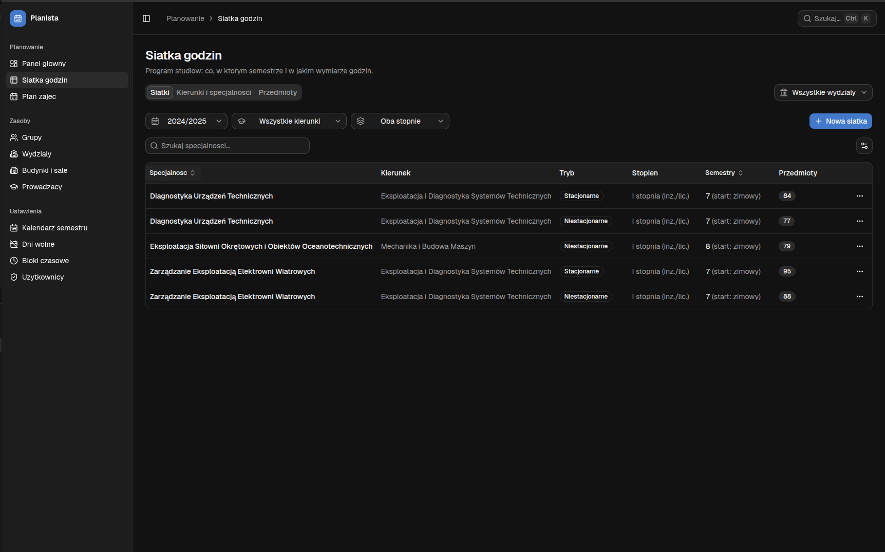
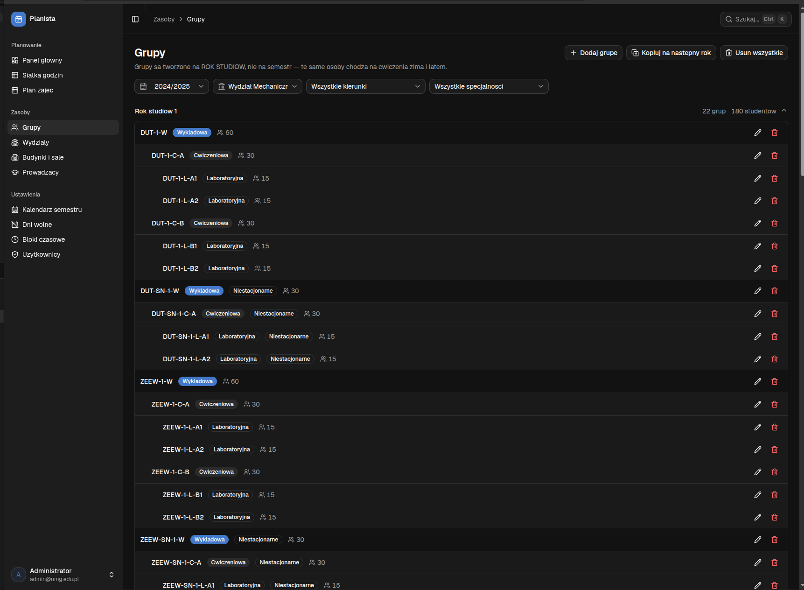
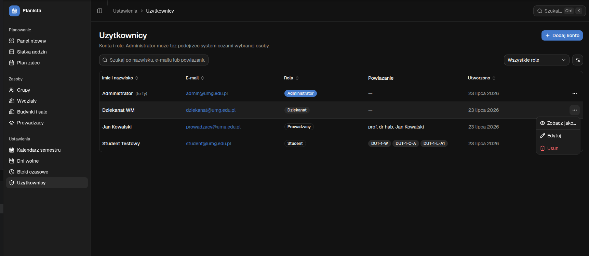
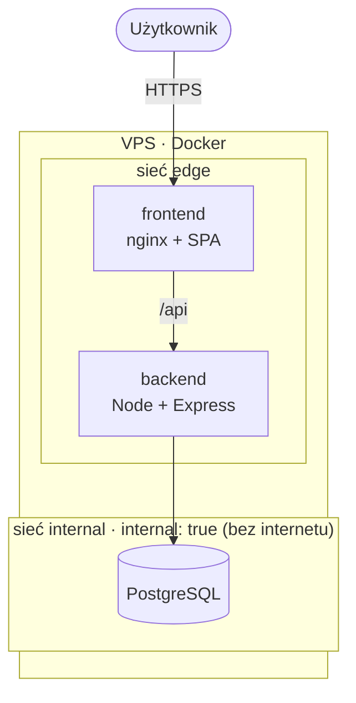
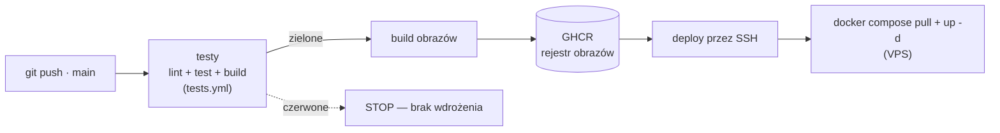

# Planista

> System układania planu zajęć dla uczelni — od siatki godzin, przez grupy i sale,
> po plan tygodnia i cały semestr, z automatycznym wykrywaniem konfliktów.

[](https://github.com/robZuk/planista/actions/workflows/ci.yml)
[](https://github.com/robZuk/planista/actions/workflows/deploy.yml)

🔗 **Demo na żywo:** [srv71-20250.wykr.es](https://srv71-20250.wykr.es) · 🔑 zaloguj się jako `admin@umg.edu.pl` / `Admin1234!`
📖 **Dokumentacja API (Swagger):** [srv71-20250.wykr.es/api/docs](https://srv71-20250.wykr.es/api/docs)



---

## Czym jest Planista

Aplikacja webowa, w której dziekanat układa plan zajęć dla całej uczelni: definiuje
zasoby (sale, prowadzących, bloki czasowe), buduje **siatki godzin** kierunków,
generuje **grupy** studenckie, a następnie układa **wzorzec tygodnia** metodą
przeciągnij-i-upuść i **generuje z niego terminy na cały semestr** — pilnując
konfliktów sal, prowadzących i grup.

## ✨ Funkcje

- **Plan zajęć — wzorzec tygodnia:** siatka dzień × godzina, układanie zajęć
  **drag & drop** z backlogu „Do zaplanowania", kolory wg formy (wykład/ćwiczenia/lab),
  **wykrywanie konfliktów** (sala / prowadzący / grupa) na żywo.
- **Generator terminów:** ze wzorca powstają terminy na cały semestr wg kalendarza,
  z **odwoływaniem i przenoszeniem** zajęć (jeden termin albo cała seria) i dniami wolnymi.
- **Siatka godzin (curriculum):** kierunki, specjalności, przedmioty, wersje siatek
  z podziałem na semestry i typy zajęć.
- **Grupy:** kreator hierarchii (wykład → ćwiczenia → laboratorium), kopiowanie rocznika na następny rok.
- **Zasoby:** pełny CRUD wydziałów, budynków i sal, prowadzących, bloków czasowych.
- **Dashboardy per rola:** kafelki, wykres obciążenia tygodnia, pasek statusów terminów;
  własny plan prowadzącego i studenta.
- **Użytkownicy i role:** ADMIN / dziekanat / prowadzący / student, **impersonacja**
  („zobacz jako…" — podgląd systemu oczami wybranej osoby).
- **Auth:** JWT z tokenem odświeżania (unieważnialnym), role, ochrona tras.

## 🖥️ Zrzuty ekranu

| Panel główny | Kalendarz semestru |
|---|---|
|  |  |

| Siatka godzin | Grupy — hierarchia (wykład → ćwiczenia → lab) |
|---|---|
|  |  |

**Użytkownicy i role — impersonacja („Zobacz jako…")**



## 🧱 Stack technologiczny

| Warstwa | Technologie |
|---|---|
| **Frontend** | React 19, Vite, TypeScript, Tailwind 4, shadcn/ui, TanStack Query/Table, zustand, react-hook-form + zod, dnd-kit, Recharts |
| **Backend** | Node.js 22, Express, TypeScript, Prisma ORM, JWT, bcrypt, zod (walidacja wejścia), Swagger UI (OpenAPI 3.1), pino (logi strukturalne) |
| **Baza** | PostgreSQL 16 |
| **Testy** | Vitest (logika domenowa + API przez supertest, Prisma mockowana), Playwright (E2E) |
| **DevOps** | Docker (multi-stage), Docker Compose, nginx, GitHub Actions (CI + CD), GHCR, VPS (Ubuntu) |

## 🏗️ Architektura

Cały system działa w kontenerach. Usługi są w **dwóch sieciach** (defense in depth):
na zewnątrz wystawiony jest **tylko** frontend, baza jest odcięta od internetu.



- **frontend** (nginx) serwuje statyczny build SPA i proxuje `/api` na backend.
- **backend** jest mostem: w `edge` (woła go front) i `internal` (dostęp do bazy).
- **db** jest **tylko** w `internal` — brak portu na hoście, brak trasy do internetu,
  niewidoczna dla frontu.

## 🚀 DevOps

To rdzeń projektu — pełny łańcuch od kodu do działającej produkcji.

### CI/CD



- **Bramka jakości:** deploy rusza **dopiero po zielonych testach** (`needs`) — czerwony test
  zatrzymuje wdrożenie. Definicja testów jest raz, w **reusable workflow** (`tests.yml`),
  wołanym przez CI i CD.
- **CI** (`ci.yml`): na push i PR — lint, testy i build backendu i frontu (osobne joby); brama dla PR-ów.
- **E2E w CI** (`ci.yml`, job `e2e`): osobny job stawia **cały stack** (docker compose + migracje
  + seed) i klika po prawdziwym UI (Playwright); raport HTML idzie jako artifact. **Świadomie
  NIE jest bramką deployu** — deploy ma własną, niezależną bramkę na szybkich testach, a flaky
  E2E nie może wstrzymać wdrożenia.
- **CD** (`deploy.yml`): na push do `main` — testy → build obrazów → push do **GHCR** →
  **SSH na VPS** → `git pull` + `docker compose pull` + `up -d`. Zmiany tylko w dokumentacji
  nie wywołują deployu (`paths-ignore`).

### Konteneryzacja

- **Multi-stage Dockerfile** — osobne targety: `dev` (hot-reload), `build`, `runner` (prod).
- **Dwie ścieżki:** dev (Vite HMR + `tsx watch`, kod montowany) i prod (zbudowane obrazy,
  backend `node dist` z `prisma migrate deploy`, frontend serwowany przez nginx).

### Bezpieczeństwo i niezawodność

- **Segmentacja sieci** (edge / internal) — baza odcięta, tylko front wystawiony.
- **Kontenery jako nie-root** (least privilege) — backend jako użytkownik `node`,
  frontend na obrazie `nginx-unprivileged` (uid 101). Ewentualna kompromitacja
  procesu nie daje roota w kontenerze.
- **Walidacja wejścia** (zod) na trasach zapisu API + **centralny handler błędów**
  (jedno miejsce zamiany wyjątku na odpowiedź HTTP) — m.in. wymóg min. długości hasła
  i formatu e-mail już po stronie serwera, nie tylko formularza.
- **Logi strukturalne** (pino + pino-http) — każde żądanie logowane (metoda, URL, status,
  **czas odpowiedzi**) z **request-id** (nagłówek `x-request-id`); w dev czytelne kolorowo,
  na prod surowy JSON gotowy pod agregację. Nieobsłużone 500 lecą do logu ze stackiem.
  *(Uptime i error-tracking przez SaaS — w planie.)*
- **Rate-limit** na logowaniu + `trust proxy` (prawdziwe IP zza nginx).
- **Graceful shutdown** (obsługa SIGTERM → czyste zamknięcie ~0,15 s zamiast SIGKILL).
- **HEALTHCHECK** w obrazie backendu (Docker wie, czy żyje sama aplikacja).
- **HTTPS** na własnym VPS (Mikrus + darmowa domena `wykr.es`, SSL na brzegu).
- **fail2ban** na serwerze — automatyczny ban IP przy próbach brute-force SSH.
- **Cache SPA** w nginx — `index.html` bez cache (deploy widoczny od razu), zahashowane
  assety cache'owane na długo.
- Sekrety poza repo (`.env.prod` w `.gitignore`).

## ▶️ Uruchomienie lokalne

Wymagany Docker. Cały system startuje jednym poleceniem:

```bash
docker compose up          # DEV — hot-reload, http://localhost:5174
# lub: make dev
```

Wersja produkcyjna lokalnie (nginx, zbudowane obrazy):

```bash
docker compose -f docker-compose.prod.yml up --build   # http://localhost:8080
# lub: make prod
```

Skróty w `Makefile`: `make dev`, `make prod`, `make down`, `make logs` (`make` = lista celów).

### Konta demo

| Rola | Email | Hasło |
|---|---|---|
| ADMIN | admin@umg.edu.pl | `Admin1234!` |
| Dziekanat | dziekanat@umg.edu.pl | `Dziekanat1234!` |
| Prowadzący | prowadzacy@umg.edu.pl | `Prowadzacy1234!` |
| Student | student@umg.edu.pl | `Student1234!` |

## 🧪 Testy

Piramida testów na trzech poziomach.

**Jednostkowe i integracyjne — Vitest** (bez bazy: Prisma mockowana, więc biegną
szybko i deterministycznie). W CI jako **bramka przed wdrożeniem** — czerwony test
zatrzymuje deploy.

```bash
cd backend && npm test     # walidacja planu (konflikty, okna czasu, izolacja semestru) + API (supertest)
cd frontend && npm test    # czysta logika domenowa (semester, konflikty, zakres planu)
```

- **Backend** — pełne pokrycie logiki walidacji (`validateEntry` / `validateTemplate`:
  wszystkie typy konfliktów, pojemność sali, okna trybu studiów, izolacja typu
  semestru zima/lato) oraz testy API HTTP przez **supertest** (health, walidacja wejścia,
  strażnik auth, fallback 404).
- **Frontend** — czysta logika (`semester`, `scheduleConflicts`, `planScope`, `unplannedItems`).

**E2E — Playwright** (`frontend/e2e/`): klikają po prawdziwym UI przeciwko działającemu
stackowi — logowanie, walidacja formularza, ochrona tras, nawigacja.

```bash
docker compose up -d        # cały stack (migracje + seed: patrz frontend/e2e/README.md)
cd frontend
npx playwright install chromium
npm run e2e                 # (e2e:ui — podgląd kroków, e2e:report — raport HTML)
```

W CI biegną w osobnym jobie (stawia stack, migracje + seed), **bez blokowania deployu**;
raport HTML trafia jako artifact.

## 📁 Struktura

```
backend/    Express + Prisma (routes / controllers / services / lib / schemas / middleware)
frontend/   React + Vite (pages / api / store / lib / components); e2e/ — testy Playwright
db/         zrzut bazy + skrypt czyszczenia
docs/       dokumentacja (model danych, deploy na VPS)
.github/    workflows CI/CD
docker-compose.yml · docker-compose.prod.yml · Makefile
```

Dokumentacja API online: **[`/api/docs`](https://srv71-20250.wykr.es/api/docs)** (Swagger UI,
spec OpenAPI 3.1 generowany z tych samych schematów zod, które walidują wejście).

Szczegóły domenowe: [`docs/model-danych.md`](docs/model-danych.md) ·
wdrożenie: [`docs/deploy-mikrus.md`](docs/deploy-mikrus.md).
